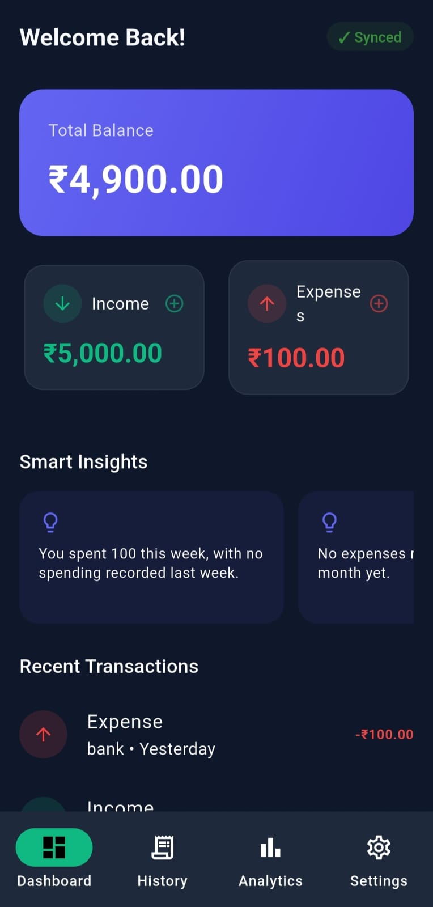
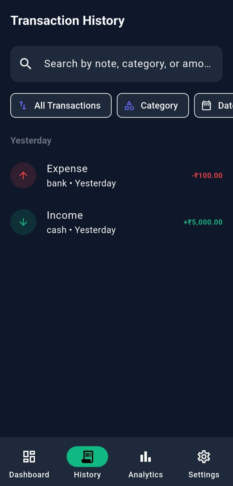
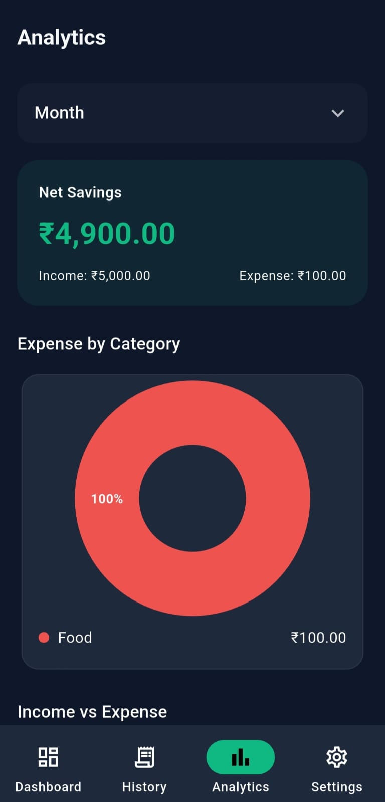
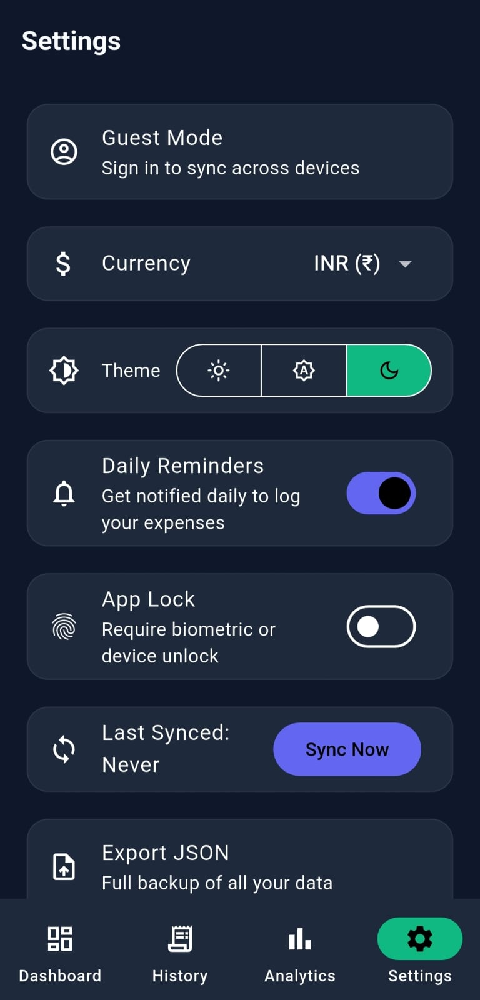

# 💰 Expense Manager

A feature-rich, offline-first Flutter application for tracking expenses, managing budgets, and analyzing personal finances with hybrid SQLite and Firebase Cloud Firestore synchronization.

---

## 📱 App Screenshots

|                        Dashboard                        |                           Transactions                            |                                                     Analytics                                                     |                                                    Settings                                                     |
|:-------------------------------------------------------:|:-----------------------------------------------------------------:|:-----------------------------------------------------------------------------------------------------------------:|:---------------------------------------------------------------------------------------------------------------:|
|  |  |   |   |

---

## 📥 Download APK

You can download the ready-to-install Android APK directly from the project repository:

👉 **[Download Expense Manager APK (v1.0.0)](build\app\outputs\flutter-apk\app-release.apk)**

---

## ✨ Features

- **Offline-First Storage**: Local database persistence using `sqflite` for fast and seamless offline usage.
- **Cloud Sync**: Automatic synchronization with Google Firebase Firestore when online via custom sync queues.
- **Multi-Account & Category Management**: Track transactions across custom accounts (Bank, Cash, Cards) and categories.
- **Budgeting & Insights**: Set monthly budgets per category and monitor spending trends.
- **Data Export & Backup**:
    - Export transactions to **CSV** format.
    - Full **JSON** backup and restore capability.
- **User Authentication**: Firebase Auth support for secure multi-user data isolation.

---

## 🛠️ Architecture & Tech Stack

- **Frontend Framework**: [Flutter SDK](https://flutter.dev) (Dart)
- **State Management**: `provider` pattern for reactive state updates
- **Local Database**: `sqflite` (SQLite plugin for Flutter)
- **Backend & Auth**: Firebase Auth & Cloud Firestore
- **Testing**: Unit & Widget tests via `flutter_test` and `mocktail`

---

## 🚀 Getting Started

### Prerequisites

- [Flutter SDK](https://docs.flutter.dev/get-started/install) (latest stable version)
- Android Studio / VS Code with Flutter extension
- An active Android Emulator or physical test device

### Installation

1. **Clone the repository:**
   ```bash
   git clone [https://github.com/sakshiS004/expense_manager.git](https://github.com/sakshiS004/expense_manager.git)
   cd expense_manager
